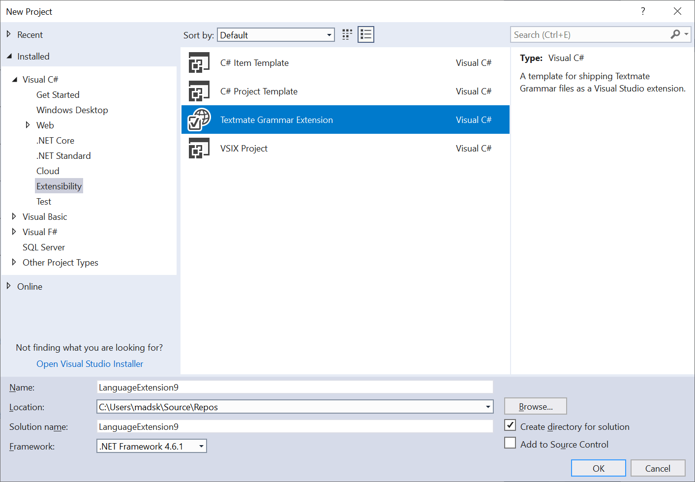
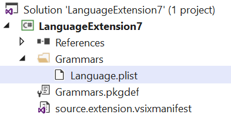
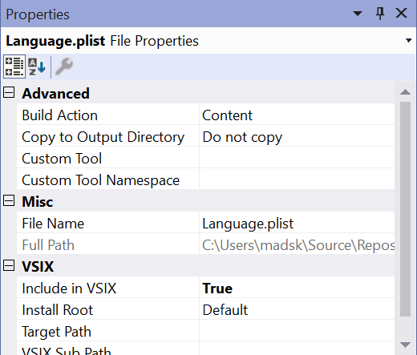

# Textmate Grammar Template

Download the extension from the [Visual Studio Marketplace](https://marketplace.visualstudio.com/items?itemName=MadsKristensen.TextmateTemplate) or get the latest [CI build](http://vsixgallery.com/extension/2913ed5b-5767-43f5-be7c-ff5c68754bc3/)

--------------------------------------

A template for shipping Textmate Grammar files as a Visual Studio extension.

A simple project is created with everything needed to ship a Textmate Grammar files.

Replace the Grammar/Language.plist file with any XML or JSON based grammar file and make sure the files are marked as **Content** and **Inluded in VSIX**.

Now build the project and a .vsix files is generated in the /bin directory. This is the extension containing the Textmate grammar.

## License
[Apache 2.0](LICENSE)